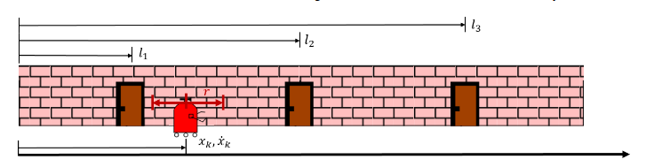
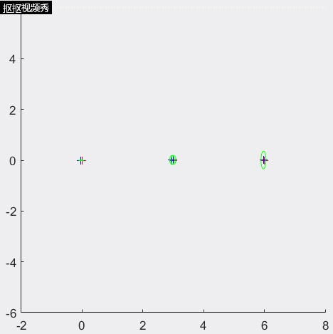

# EKF_SLAM_1D

Consider the mobile robot illustrated in the figure below. It moves at constant velocity in a single degree of freedom,  along  a  hallway.  It  is  equipped  with  a  bi-directional laser range beam  with  maximum  range  r, which is capable of sensing the doors in the hallway. The robot is also equipped with wheel encoders that provide a source of odometry sensing. The three doors depicted will serve as our navigation landmarks - we will assume they are point-landmarks of negligible width at locations 𝑙1, 𝑙2, 𝑙3.  We know with very high confidence that the robot starts moving from the origin, at the beginning of the hallway. However, we do not have a prior map of the hallway, and we do not know the locations of the three landmarks – the robot will need to discover them and estimate their locations through its measurement process. It will also, in turn, use those landmark measurements to curb the growth of its own localization uncertainty.

This repository is to implement a SLAM procedure that allow robot to localize itself along its moving trajectory with the highest possible accuracy, despite the fact that it does not know the landmark locations in advance.We will perform a incremental, continuous time state estimation using Extended Kalman filter over the odometry and landmark measurements(with a state vector that includes robot and landmark states)

The picture below is hallway with three landmark set on it.

    

In this simulation, the moving triangle are simulated robot and estimated location of that moving robot. The cross signs are landmark which are set up first. With robot moving along the path, the estimated location of robot and landmark and its corresponding covariance.
<!--
[]
-->
